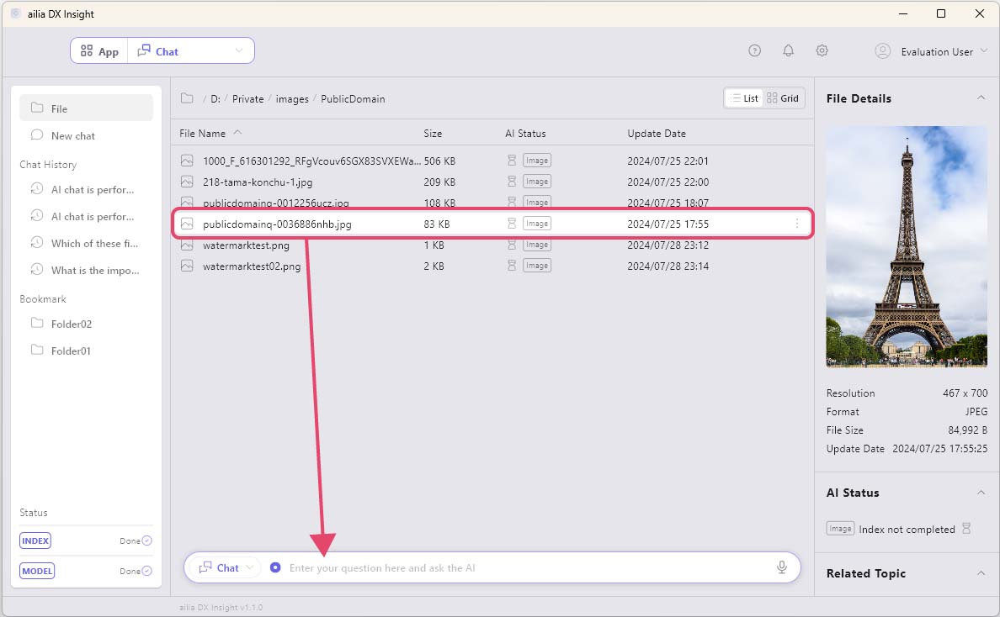

# Ask Questions About Image Files

When you register an image file in the index, you can ask questions about that image. 
Please set the app menu on the top left of the screen to "Chat".

1. Drag and drop the image file into the chat box at the bottom of the screen. (In Windows, you can also drag and drop directly from Explorer into the chat box, and on Mac, from Finder.) 
   
1. Once the image you dropped into the chat box appears, enter your question and send it. 

1. The response from AI will be displayed. 

 

#### [Next&emsp;＞](SummarizeDocument.md)
#### [Back to Index](UseAI.md)