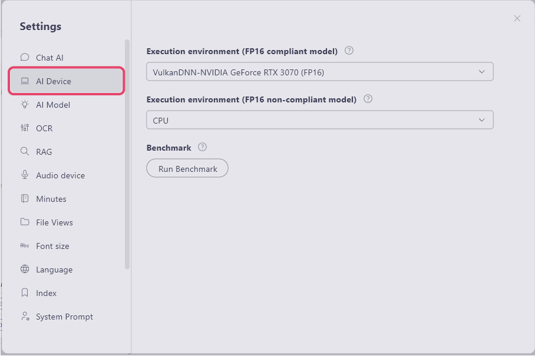
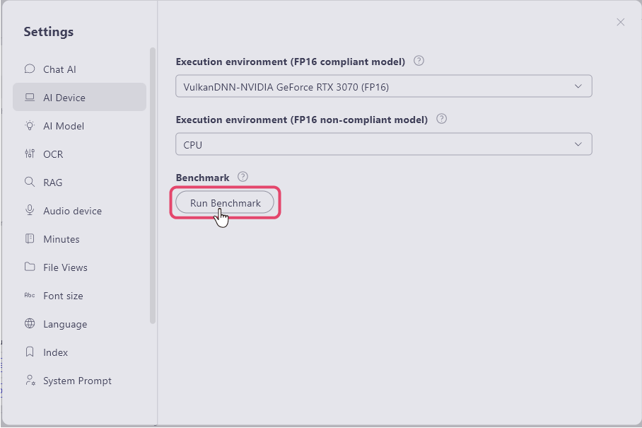
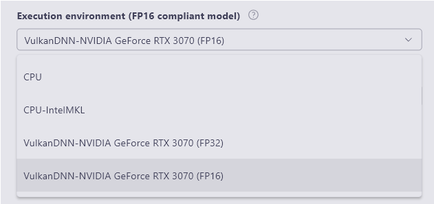
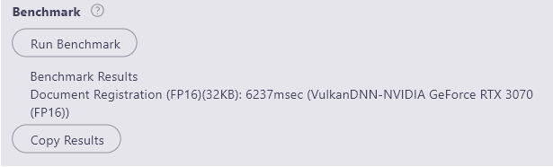

# Benchmark Function
You can use the features within ailia DX Insight to measure the benchmark of the AI execution environment on your hardware. Please use it as a reference when you are undecided on which LLM to use from the numerous available LLMs or when deciding on a PC to use.

1. Select the "AI Device" item in the settings. 
 
2. Select the execution environment. 
   Image search and voice search query processing, and reranking are models that do not support FP16. All other models for text registration, image registration, voice registration, OCR, and voice recognition support FP16. All models targeted for benchmarking are FP16 models. Therefore, please change the item above for "Execution Environment (FP16 Supported Models)." 
    
   Options for GPU and CPU will be displayed, so select the one you will use for generation. 
    
3. The time taken for document registration during generation will be measured, and the results will be displayed. 
<b>

 

#### [Next Page&emsp;＞](Security.md)