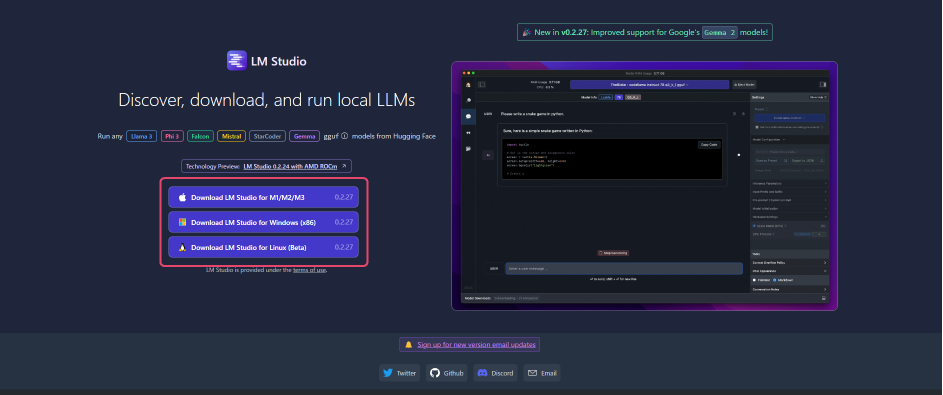
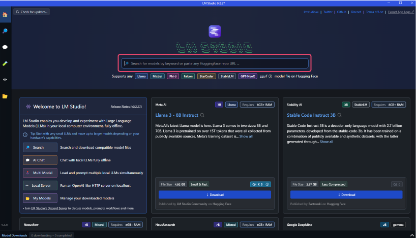
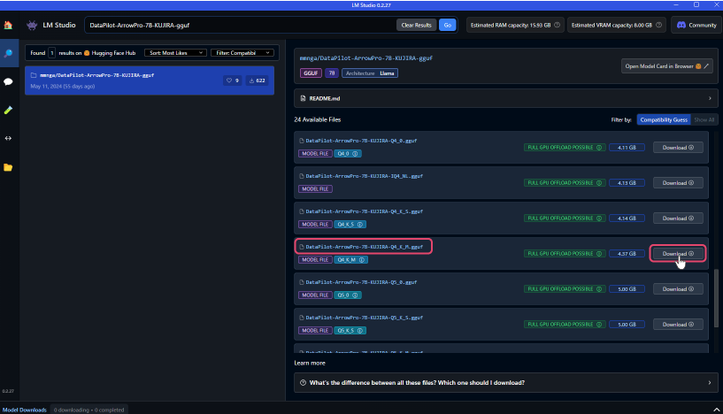
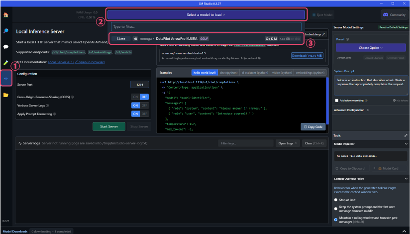
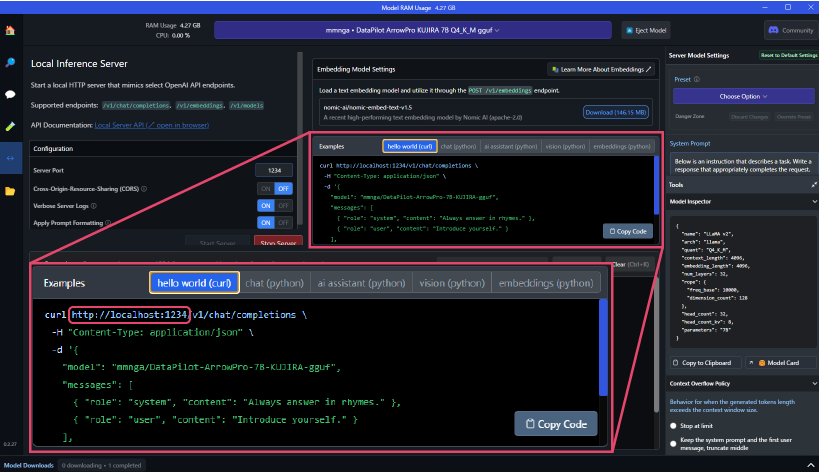
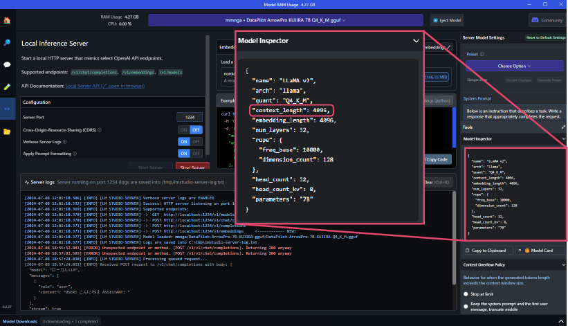
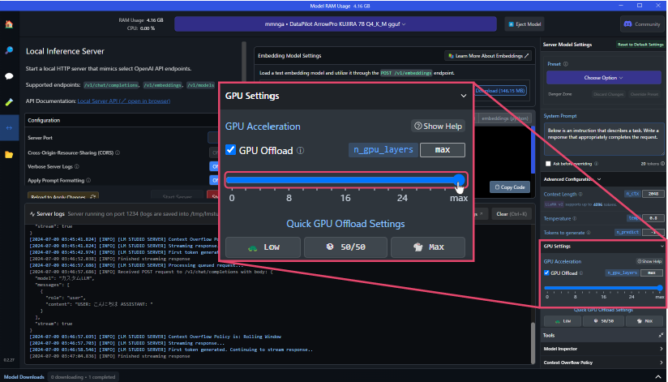

# Build Custom LLM with LM Studio
## Installing LM Studio
1. Install LM Studio from [https://lmstudio.ai/](https://lmstudio.ai/) 
 

## Downloading Custom LLMs
1. Launch LM Studio and search for LLM from the search bar in the center of the screen.
Using "DataPilot-ArrowPro-7B-KUJIRA-gguf" as an example, let's build an LLM. 
 
1. Search results will appear on the right side of the screen. 
Once you find the desired LLM, click "Download" to start the model download. 
 

## Launching Custom LLMs
1. After downloading, click the "↔" button in the left sidebar to change the screen mode. 
Click "Select a model to load" at the top of the screen to see the list of downloaded LLMs in a dropdown. Select the downloaded model. 
 
  * The URL for the custom LLM to be used in ailia DX Insight will be displayed near the center of the screen. (It is usually set to localhost:1234) 
 
  * The number specified in the context_length under "Model Inspector" on the right side of the screen is used as the "Maximum Token Count" in ailia DX Insight settings. 
 

## Registering Custom LLM in ailia DX Insight
Refer to [here](CustomLLM.md) for detailed settings.[here](CustomLLM.md) 
 

* Name: The name of the LLM to be used (can be anything as it is used only for UI display)
* Description: Use as a memo as needed
* Model: The name of the downloaded model
* URL(*): The URL displayed when launching the custom LLM (normally set to localhost:1234)
* Maximum Token Length: The `context_length` value displayed when launching the custom LLM
 

(*) If not filled, an HTTP connection error will occur. 

## Improving Processing Speed of Local LLMs
You can change the percentage of GPU memory usage by modifying the parameter values in "GPU Settings" under "Advanced Configuration" on the right side of the screen. 
Setting the GPU Offload parameter to the maximum allows for fast processing using GPU memory. 
 

 

#### [Next&emsp;＞](CustomLLM_Ollama.md)