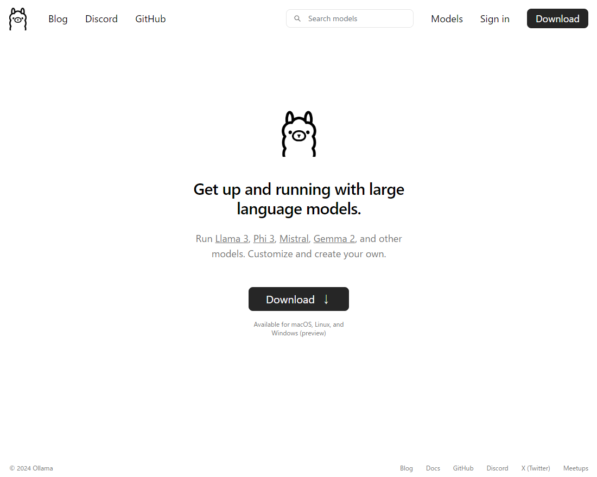
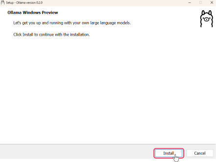
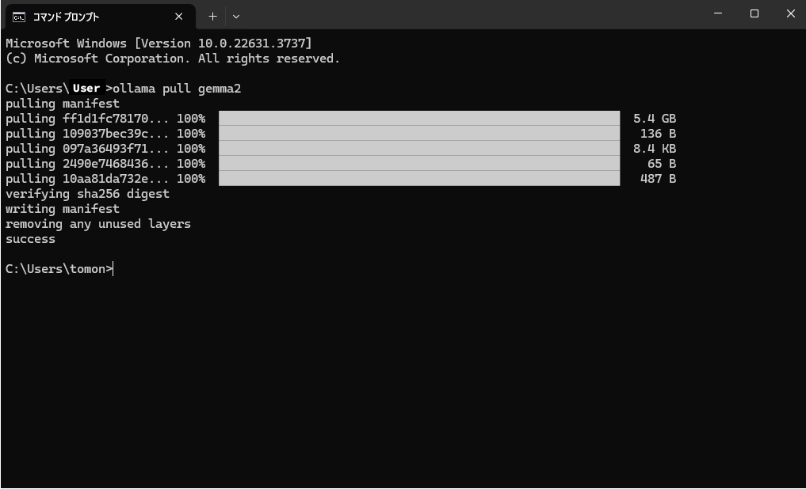
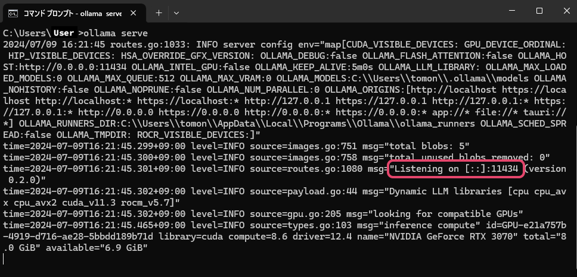

# Build Custom LLM with Ollama

## Installing Ollama

Install Ollama from [https://ollama.com](https://ollama.com)<br>
<br>

## Launching Ollama (Windows)
1. Launch the installed "OllamaSetup.exe" to install it.<br>
<br>

1. After installation, launch Command Prompt and confirm the path is set correctly.<br>
Execute `ollama --help` in Command Prompt and confirm that the following help screen appears.<br>

```
Large language model runner

Usage:
  ollama [flags]
  ollama [command]

Available Commands:
  serve       Start ollama
  create      Create a model from a Modelfile
  show        Show information for a model
  run         Run a model
  pull        Pull a model from a registry
  push        Push a model to a registry
  list        List models
  ps          List running models
  cp          Copy a model
  rm          Remove a model
  help        Help about any command

Flags:
  -h, --help      help for ollama
  -v, --version   Show version information

Use "ollama [command] --help" for more information about a command.
```

## Downloading LLMs
1. Download the LLM to run locally using the `ollama pull` command.
For example, to download Google's gemma-2-9B, enter `ollama pull gemma2` in Command Prompt.<br>
<br>
  * If you want other PCs to access this local LLM, execute `set OLLAMA_HOST=0.0.0.0` in Command Prompt and set the OLLAMA_HOST environment to "0.0.0.0".

2. Execute `ollama serve` in Command Prompt to start the LLM.<br>
<br>
  * If "Listening on [::]:11434" is displayed, it can be accessed from other PCs.
  * If "Listening on 127.0.0.1:11434" is displayed, it can only be accessed from that PC.
The value "11434" is the port number to use in the ailia DX Insight settings.

## Registering Custom LLM in ailia DX Insight
Refer to [here](CustomLLM.md) for detailed settings.<br>
<br>

* Name: The name of the LLM to be used (can be anything as it is used only for UI display)
* Description: Use as a memo as needed
* Model: The name of the downloaded model (in this example, gemma2)
* URL(*): The URL of the port displayed by ollama serve (in this example, http://localhost:11434)
* Maximum Token Length: For gemma-2-9B, it is "8192".
<br>

(*) If not filled, an HTTP connection error will occur.<br>

## Deleting Downloaded LLMs
If LLMs take up too much space or the wrong model is downloaded, you can delete them through the following steps.
1. Execute `ollama list` in Command Prompt to display the list of downloaded models.
1. Execute `ollama rm "model_name"` in Command Prompt to delete the downloaded model.
<br>
<br>


<br>

#### [Next&emsp;＞](CustomLLM_FastChat.md)