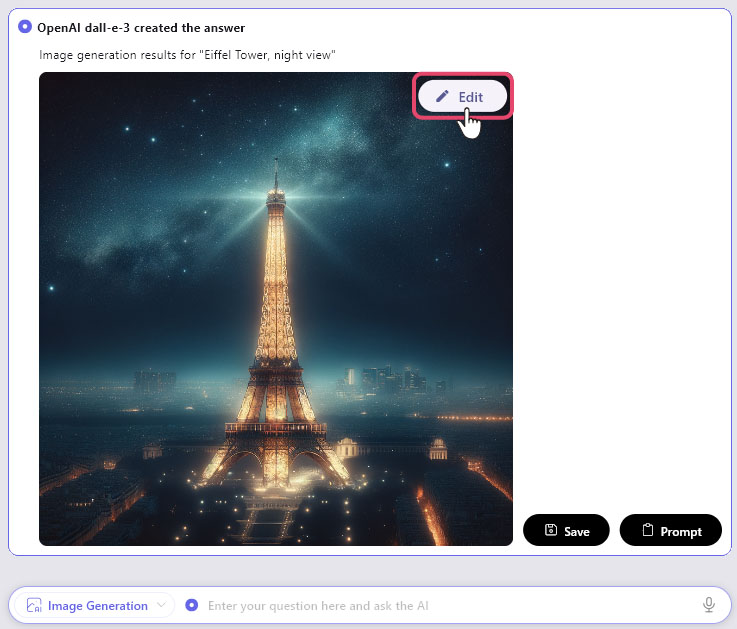
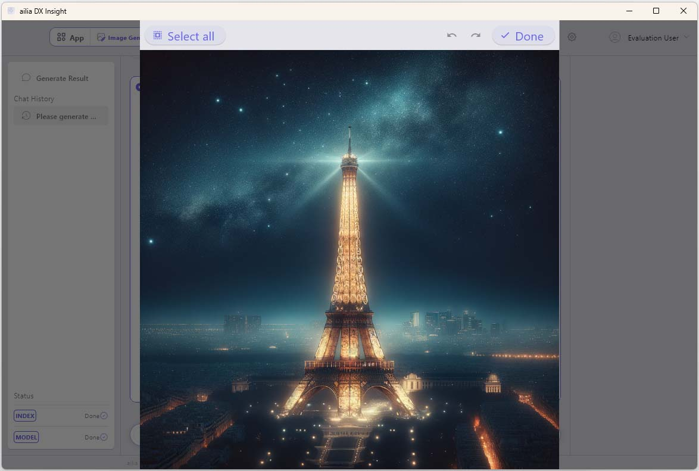
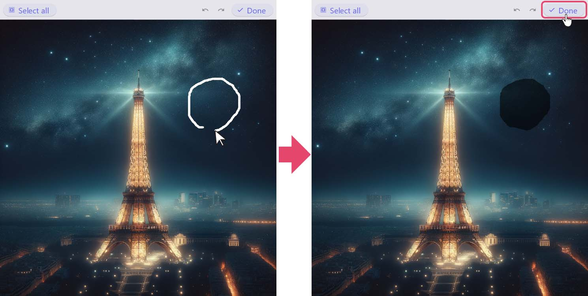
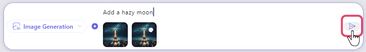
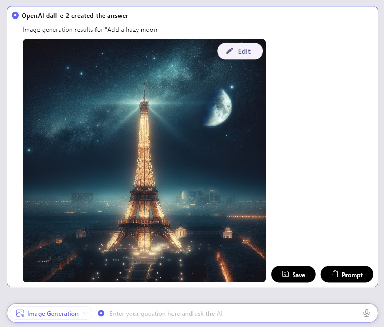
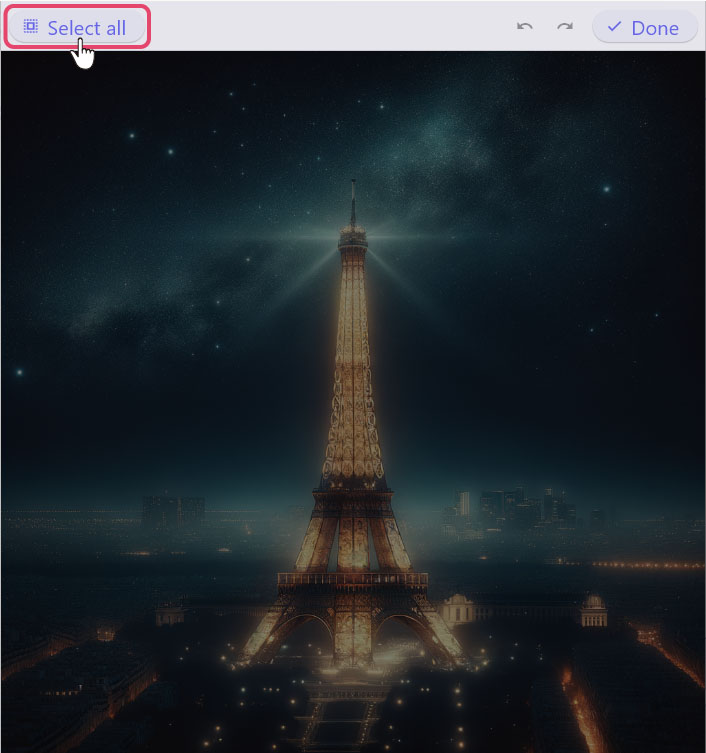
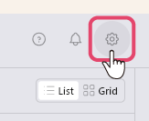
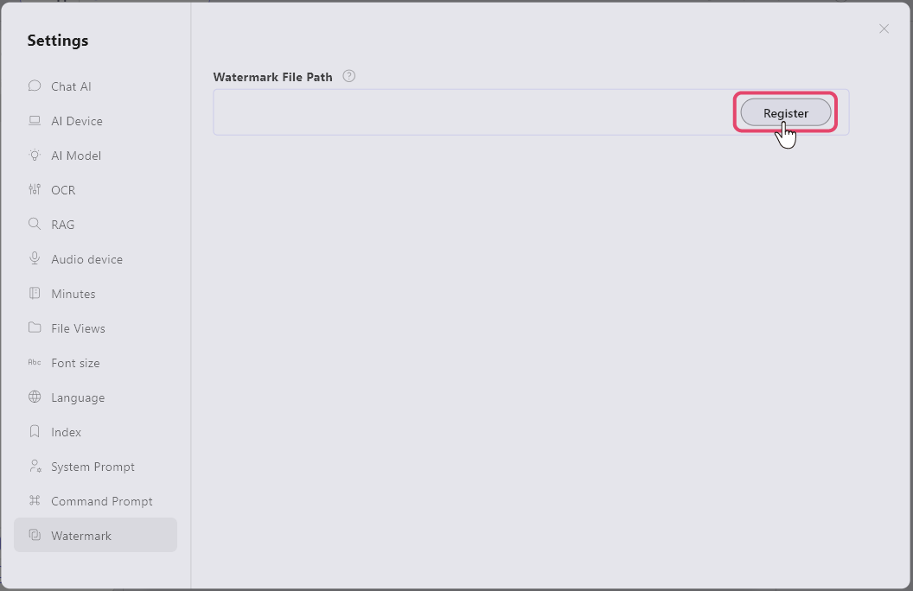
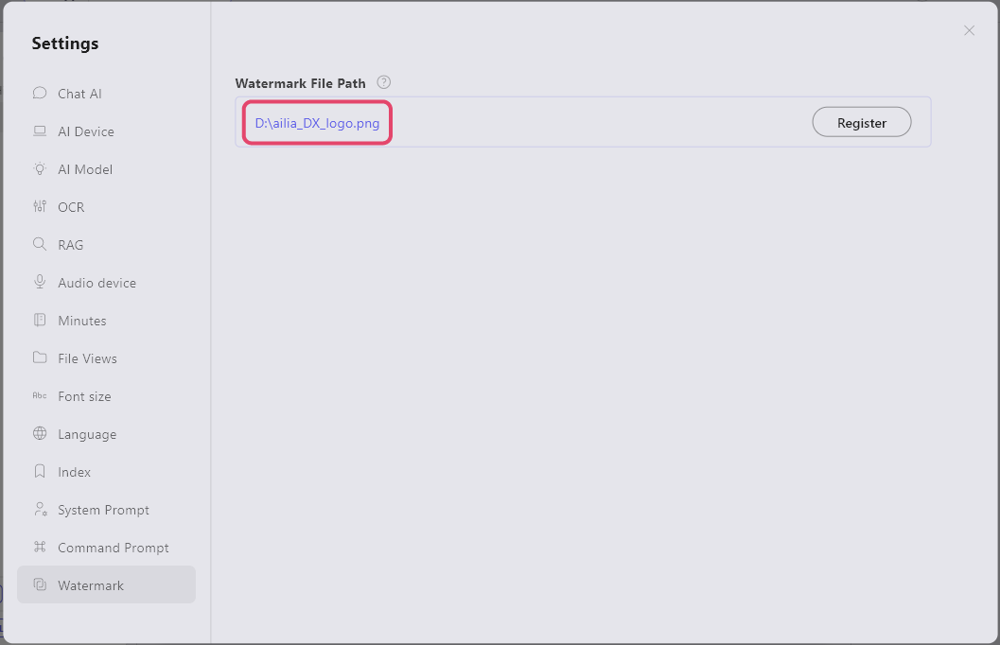
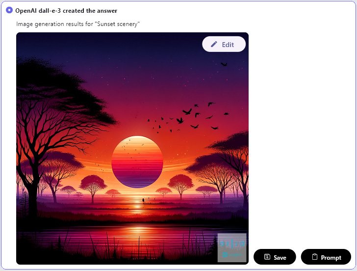

# Generate Images
Based on the text entered into the chat box, you can generate images using AI. 
*Image generation uses DALL-E and operates from GPT-4 onwards. 
※The GPT version can be selected in the settings by clicking on "OpenAI" in the "Chat AI" section.

## Generate Images from Prompts
You can generate images from keywords or text.
1. Select "Image Generation" from the app menu at the top left of the screen. 
 
1. Enter a summary of the image you want to generate, and send it.
1. The AI-generated image result will be displayed. 
 
 

## Edit the Generated Image
You can edit the generated image to make it closer to what you want.
1. Select 'Edit' displayed in the upper right corner of the generated image. 

1. The editing screen will be displayed 

1. Drag your mouse to enclose the area you want to edit, creating a mask. 
While the mask is created, select 'Done' to complete the mask creation.

1. Enter the edits you want to make in the chat box at the bottom of the screen and send. 

1. The result of AI regenerating the image is displayed. 

* 

By pressing "Select All" in the upper left corner of the image editing screen, you can select the entire screen. 

## Add a Watermark to the Generated Image
With ailia DX Insight, you can easily add a watermark to the images you generate.

As a sample, we will use this logo mark image that is 50% transparent. 

1. Press the gear icon in the top right corner of the screen. 

1. Select "Register" for the watermark image file path in the "Watermark Image" section, and select the image you want to use in the Explorer that appears. 
 

1. If the directory of the image file you want to use for the watermark is displayed, the setup is complete. 
 

* When you generate an image, a watermark will be added to the bottom right of the image. 
 
 

#### [Next&emsp;＞](Recording.md)
#### [Back to Index](UseAI.md)