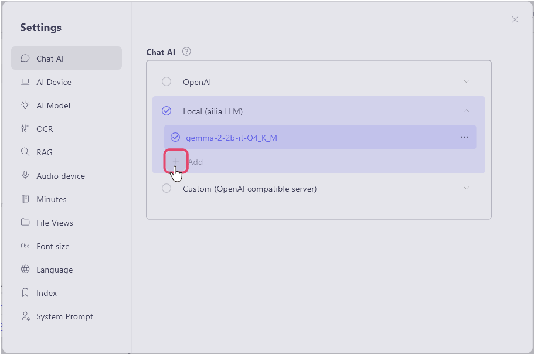
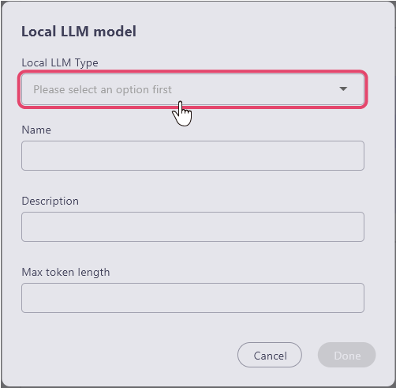
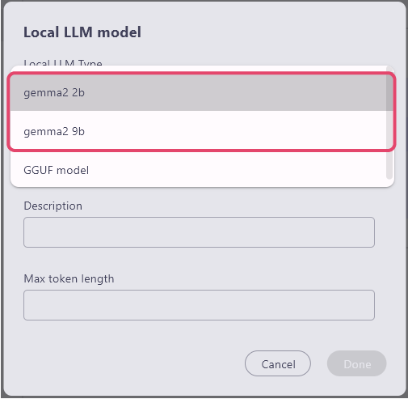
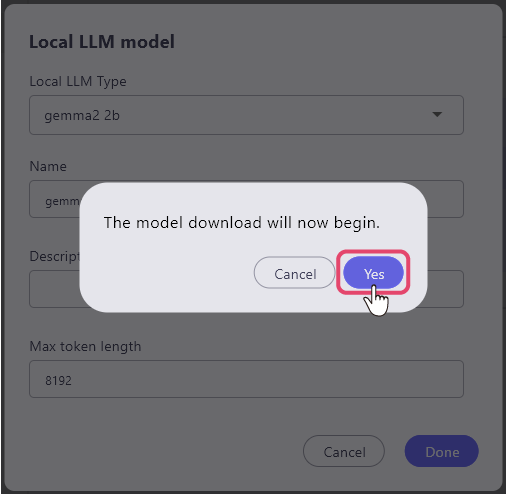
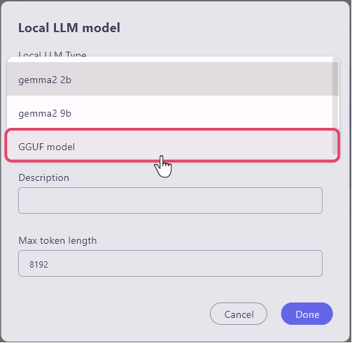
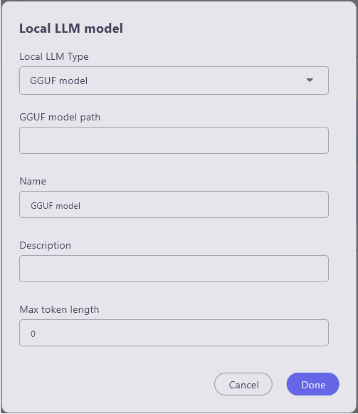

# Local LLM Configuration
By using the GGUF-compressed LLM model, you can easily connect to a local LLM only within ailia DX Insight.

The PC requirements to run a local LLM are as follows:

### For Windows

* Requirements for the 2b model
```
GPU Execution: GPU with 4GB or more VRAM supporting Vulkan 1.1 or later
CPU Execution: CPU supporting AVX2, with 8GB or more memory
```
* Requirements for the 9b model
```
GPU Execution: GPU with 6GB or more VRAM supporting Vulkan 1.1 or later
CPU Execution: CPU supporting AVX2, with 8GB or more memory
```

### For MacOS

* Requirements for the 2b model
```
Apple Silicon with 8GB or more memory
```
* Requirements for the 9b model
```
Apple Silicon with 16GB or more memory
```

## Building a Local LLM within ailia DX Insight
By using the LLM model compressed in GGUF format, you can easily connect to a local LLM solely within ailia DX Insight.

1. Select the "Chat AI" option in the settings  and choose "+ Add" for "Local (ailiaLLM)".



2. A window for registering a local LLM model will open. First, select the "Local LLM Model Type" item.<br>

<br>


### Selecting from the Standard LLM
You can download the local model just by specifying it from the standard LLM.<br>
In ailia DX Insight, you can choose from "gemma2 2b / gemma2 9b".<br>
When you select the LLM, the name and maximum token length are automatically entered. (Please enter the description item as needed)<br>
<br>

When you click "Complete" at the bottom right, a message window saying "Start downloading the model." will appear, and selecting "Yes" will start the download.<br>
<br>


### Using GGUF file
By changing the "local LLM Model Type" item to "GGUF model," the "GGUF Model Path" item will be displayed.<br>
<br>

Enter each item.<br>
<br>

* local LLM Type: Select GGUF model
* GGUF model path: Enter the directory of the GGUF file
* Name: Name of the LLM to use (can be anything as it is only used for UI display)
* Description: Use as a memo if necessary
* Max Token Length: Enter according to the downloaded model
<br>

#### [Next Page&emsp;＞](Benchmark.md)