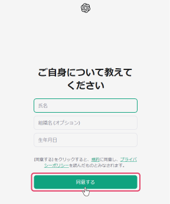
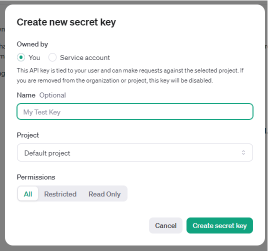

# How to Obtain an OpenAI API Key
To use OpenAI's features within "ailia DX insight," you need to obtain an API key from OpenAI. 
Furthermore, OpenAI sets [rate limits](RateLimits.md), so it is recommended to raise the rate limit ceiling, especially if used by multiple people. This requires a certain number of days (minimum of 7 days) to pass, so prompt action is necessary.

## Create an OpenAI Account
1. Select "Sign up" from the [OpenAI Platform](https://platform.openai.com/docs/overview). 
 
1. Follow the prompts to enter your email address and password, then select continue. 
 
1. You will receive an email titled "OpenAI - Verify your email" to the registered email address. Select the email verification to launch your browser. 
 
1. In the launched browser, enter your "name," "organization name (optional)," and "date of birth," and after confirming the terms and privacy policy, select agree.
 
 

## Register Your Phone Number
You need to register a phone number that can receive short messages to obtain an API key.

1. Select "Dashboard" at the top right of the OpenAI Docs page. 
 
1. From the menu on the left, select "API keys," then select "Start verification" next to the prompt "Verify your phone number to create an API key." 
 
1. Enter your phone number and select "Send code." 
 
1. You will receive an OpenAI verification code via short message to the registered phone number, which you need to enter on the next screen to complete the phone number registration. 
 

## Generate an API Key
1. Select "+ Create new secret key." 
 
1. "Create new secret key" window will appear. Enter a name of your choice to generate the API key. 
 
1. The API key will be displayed. 
* The generated API key will only be shown once, so it's recommended to copy and save it at this point.  
 

## Register Payment Information
1. Click on your account icon at the top right of the OpenAI home screen and select "Your profile." 　
 
1. You will see the Settings screen. From the menu on the left, select "Billing" and then "Add payment details." 
 
1. A window saying "What best describes you?" will appear. Select either "individual" or "Company."  
 
1. Enter your card information/billing address in the displayed window and select "Continue" to complete the registration of your payment information.
* You can manage the costs associated with API by [setting a monthly payment limit](Pricing.md).

#### [Next&emsp;＞](Pricing.md)