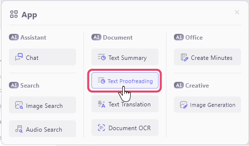
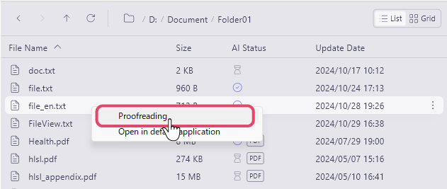
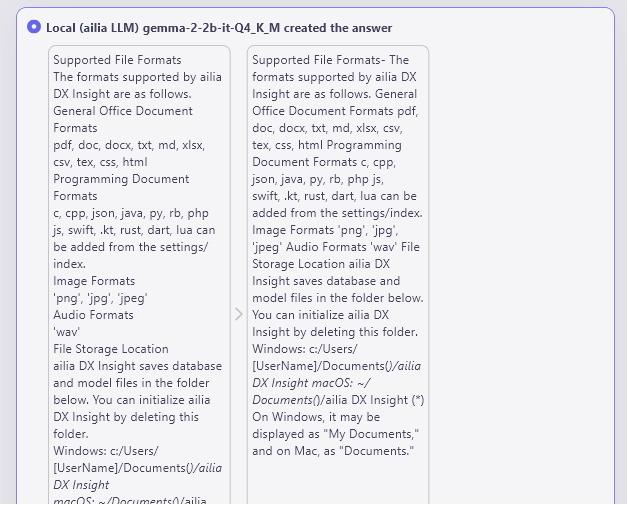

# Proofreading document files
When you index a document file, you can have the AI proofread the content of the registered document file. 
 

For information on how to index a file, please check [here](IndexRegister.md).

1. Select "Text Proofreading" from the app menu at the top left of the screen. 
 
2. Right-click the file you want to proofread and select "Proofreading."  
 
3. The AI will proofread the document, displaying the original text on the left and the proofread text on the right. 
 

 

#### [Next&emsp;＞](SearchImage.md)
#### [Back to Index](UseAI.md)