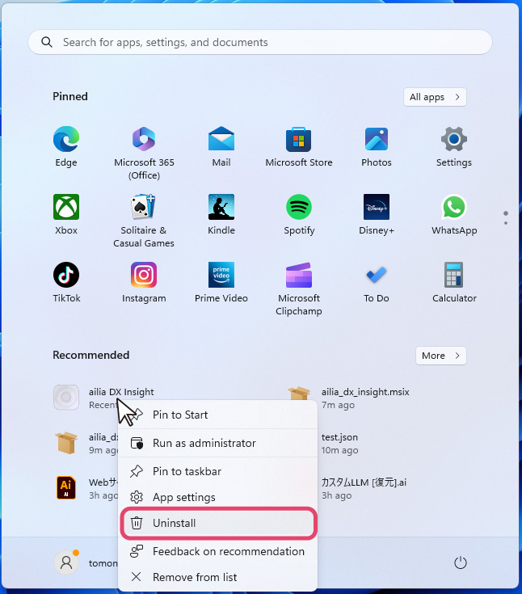
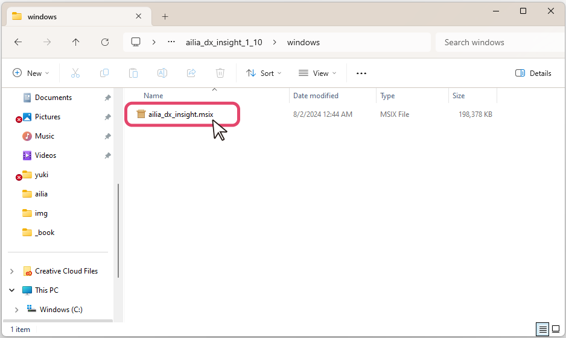
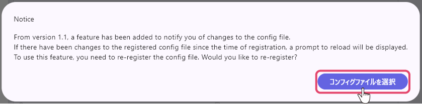
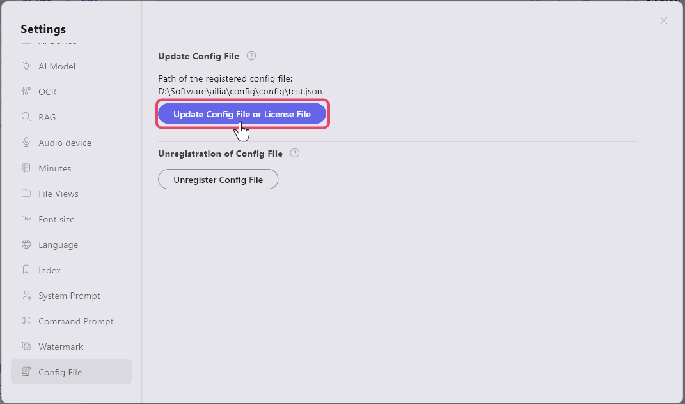

# ailia DX Insight 1.0 to 1.1 Update Guide

In ailia DX Insight 1.1, the application’s electronic certificate has been updated. In Microsoft’s installer, msix, when the electronic certificate is updated, it is recognized as a different application.   
(Reference: [https://github.com/microsoft/msix-packaging/issues/365](https://github.com/microsoft/msix-packaging/issues/365)) 
Therefore, when updating from ailia DX Insight 1.0 to 1.1, please follow the steps below to uninstall the old version before installing the new one.

## For Windows
Select ailia_dx_insight from the Start menu, right-click to uninstall.  
(If not found in the Start menu, please check under "All Apps")  
 
Double-click on ailia_dx_insight.msix to proceed with the installation.  
 
User data is saved in <code>c:/Users/[UserName]/Documents(*)/ailia DX Insight</code>, so it will be retained. 
(*) It may also be displayed as "My Documents."

## For Mac
Open ailia_dx_insight.dmg and drop ailia_dx_insight.app into the Applications folder to overwrite.

## Config File Update
If you are using a config file in ailia DX Insight 1.0, it will be necessary to update the config file. On the first launch of ailia DX Insight 1.1, the following dialog will be displayed, so please set the path to the config file.  
 
If there are changes to the file after registering the config file, a dialog confirming whether to reload will be displayed. Selecting "Yes" will reload the config file and apply the changes.  
 
Additionally, you can manually register the config file from the settings screen → config file.  
You can also unregister the config file from the same screen.  
 
  
  #### [Next&emsp;＞](MainOperation.md) 