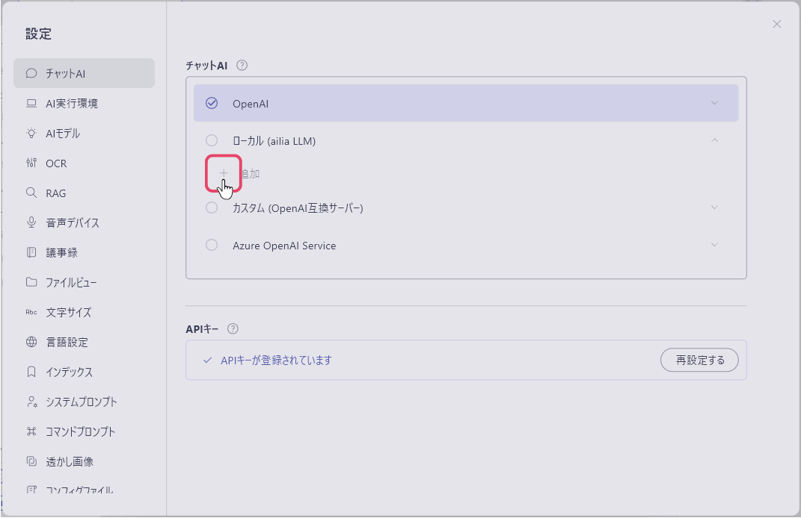
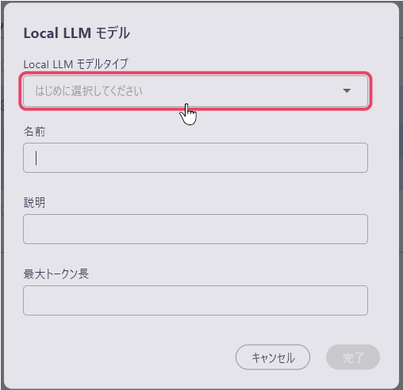
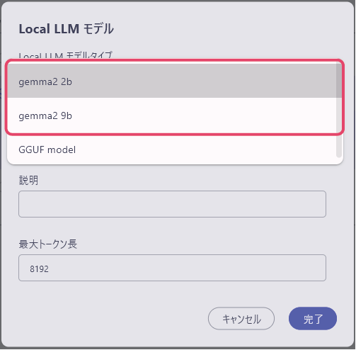
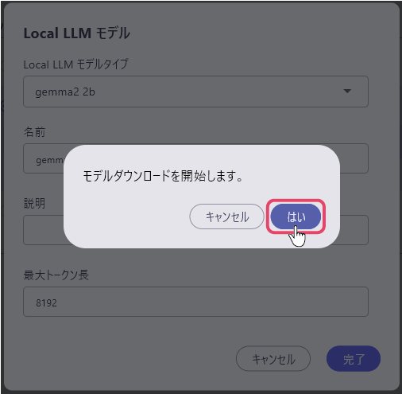
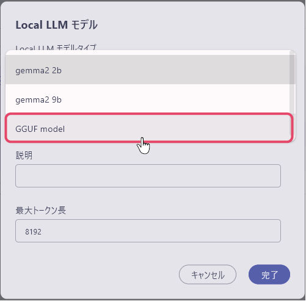
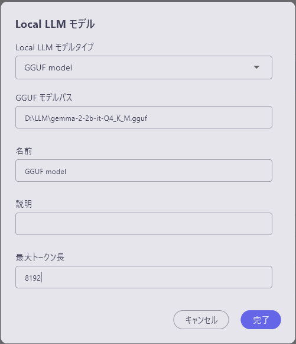

# ローカルLLMの設定
GGUF形式で圧縮されたLLMモデルを使用することで、ailia DX Insightの中だけで簡単にローカルLLMとの接続をすることができます。

ローカルLLMを実行するために必要なPC条件は下記となります。

### Windowsの場合

* 2bモデルの動作条件
```
GPU実行：Vulkan 1.1以降に対応したVRAMを4GB以上搭載したGPU
CPU実行：AVX2に対応したたCPU、8GB以上のメモリ
```
* 9bモデルの動作条件
```
GPU実行：Vulkan 1.1以降に対応したVRAMを6GB以上搭載したGPU
CPU実行：AVX2に対応したCPU、8GB以上のメモリ
```

### MacOSの場合

* 2bモデルの動作条件
```
8GB以上のメモリを搭載したApple Silicon
```
* 9bモデルの動作条件
```
16GB以上のメモリを搭載したApple Silicon
```


## ailia DX Insight内でのローカルLLMの構築

1. 設定の中のチャットAIの項目を選択し、「ローカル（ailiaLLM）」の「+追加」を選択します。



2. ローカルLLMモデル登録用ウィンドウが開きます。まずはじめに「Local LLM モデルタイプ」の項目を選択します。<br>
<br>

### 規定のLLMから選択する
規定のLLMから指定をするだけで、ローカルモデルをダウンロードをすることができます。<br>
ailia DX Insightでは「gemma2 2b / gemma2 9b」の二つから選択可能です。<br>
LLMを選択すると、名前と最大トークン長が自動で入力されます。（説明の項目は必要に応じて任意で入力してください）<br>
<br>

右下の完了をクリックすると、「モデルのダウンロードを開始します。」というメッセージウィンドウが表示され、「はい」を選択すると、ダウンロードが開始されます。<br>
<br>


### GGUFファイルを使用する
「local LLM モデルタイプ」の項目を「GGUF model」に変更することで、「GGUF モデルパス」の項目が表示されます。
<br>

各項目を入力します。<br>
<br>

* local LLM モデルタイプ：GGUF modelを選択
* GGUFモデルパス：GGUFファイルのディレクトリを入力
* 名前：使用するLLMの名称 (UI表示にのみ使用するため何でも構わない)
* 説明：必要に応じてメモとして使用
* 最大トークン長：ダウンロードしたモデルに応じたものを入力
<br>

#### [次のページへ&emsp;＞](Benchmark.md)