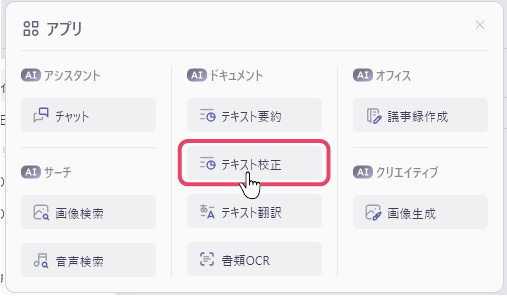
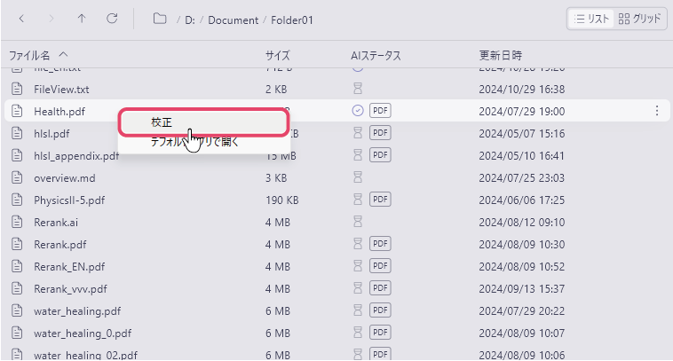
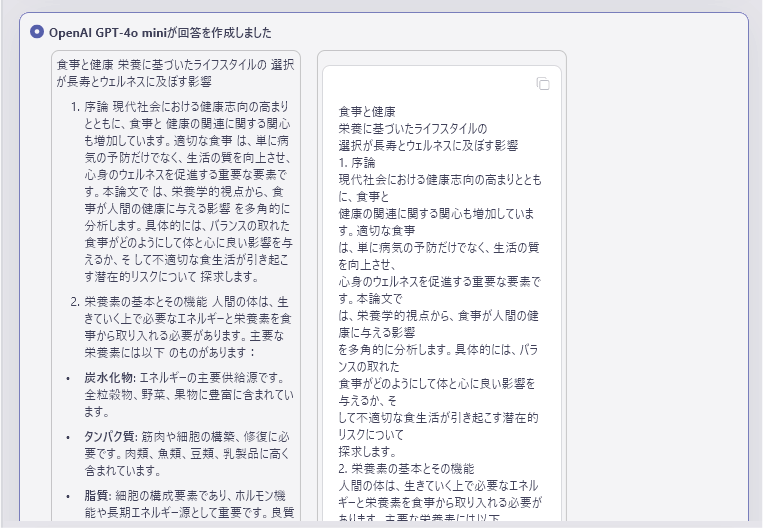

# 文書ファイルを校正する
文書ファイルをインデックス登録すると、登録した文書ファイルに記載されている内容をAIに校正させることができます。
 

ファイルをインデックス登録する方法については[こちら](IndexRegister.md)をご確認ください。

1. 画面左上のアプリメニューから「テキスト校正」を選択します。 
 
2. 校正したいファイルを右クリックし、「校正」を選択します。 
 
3. AIが文書を校正し、校正前の文章が左に、校正結果の文章が右に表示されます。 
 

 

#### [次のページへ&emsp;＞](SearchImage.md)
#### [一覧に戻る](UseAI.md)