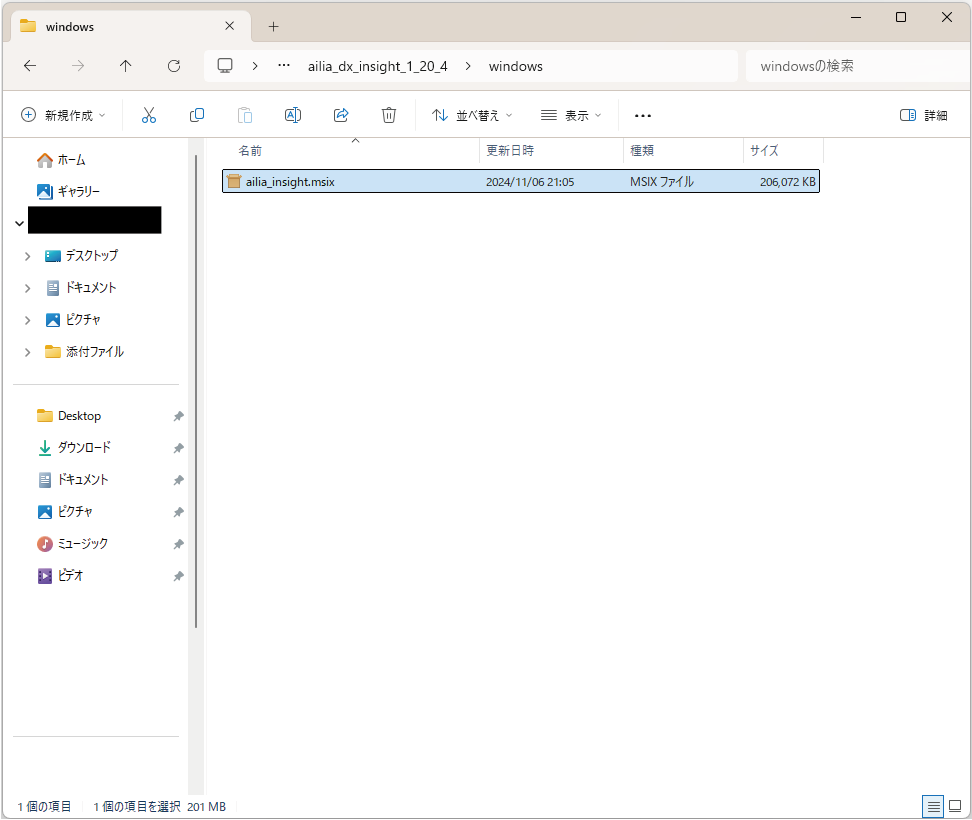
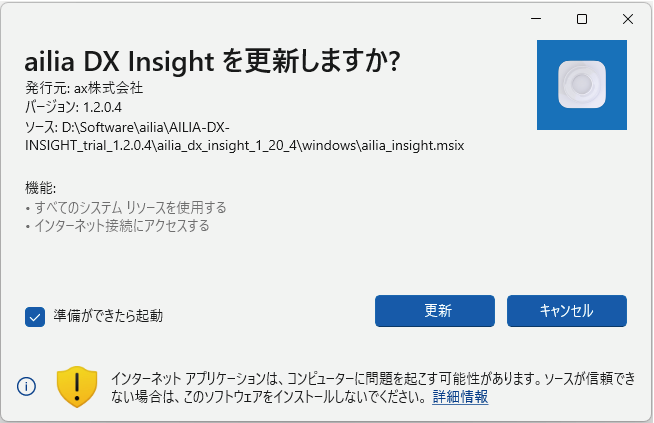

# バージョン1.2.0リリースノート

## ailia DX Insight1.1から1.2へのアップデートガイド
ailia DX Insight1.1と1.2は電子証明書が同一になっています。 
1. Windowsの場合はailia DX Insight1.1から1.2へアップデートは「ailia_insight.msix」をダブルクリックします。 

1. 「ailia DX Insightを更新しますか？」というウィンドウが表示されますので、「更新」を選択してください。 

1. ailia DX Insight1.2がインストールされた後、アプリケーションが起動されます。

## 機能追加
### チャット機能
* [ローカルLLMに対応](LocalLLM.md)
* [マークダウンの表示に対応](AskToAI.md#update00)
* [コードをコピーするボタンを追加](AskToAI.md#update01)
* [送信時にモデル選択する機能を追加](AskToAI.md#update02)

### ファイルビュー
* [ファイルビューにクイックアクセス用のボタンを追加](FileView.md#update03)
* [初期ディレクトリ設定に対応](FileView.md#update04)

### RAG
* [文章全体を渡してチャットするモードを追加（DOCモード）](DocumentFile.md#update05)
* [複数のファイルを選択してDOCモードを使用する機能を追加](DocumentFile.md#update06)

### 議事録
* [Whisper Large V3 Turboに対応](overview.md#update06)

### その他
* [AI実行環境のベンチマーク機能の追加](Benchmark.md)

### OpenAIのモデル変更
* GPT3.5の削除
* GPT-4o mini対応

### UI
* [設定画面のコンフィグファイルの設定にライセンスファイルの有効期限を表示](ConfigFile.md#update07)
* [校正と翻訳で変更前と変更後を表示](Translation.md#update08)
* [画像編集で画像全体を選択するボタンを追加](GenerateImage.md#update09)

## 改善
* GPUを使用した場合のドキュメント登録の高速化
* エクセルのインポートにおいて、末尾の空白を削除
* 1行の中でテキストが分割されたPDFの翻訳の精度改善

## 不具合修正
* 翻訳のコマンドプロンプトを編集しようとすると校正のプロンプトという表示がある問題を修正
* チャット欄に大量の文章を入れるとオーバフローする問題を修正
* チャットヒストリーの左右の幅を広げにくい問題を修正
* Geminiでシステムプロンプトが適用されない問題を修正
* libllama.dylibがmacOS14向けにビルドされているためmacOS13で起動できない問題を修正

 

#### [次のページへ&emsp;＞](v1_1update.md)
